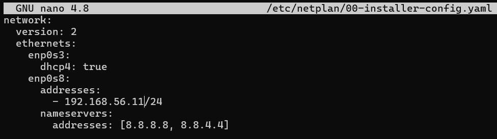

## Introduction

In this guide, we're going to provision a multi-node Kubernetes cluster using kubeadm and VirtualBox. This will include only one control plane node and two worker nodes, but you can scale it to more control and worker nodes as of your requirements.

## Prerequisites

-   At least **8GB RAM** of RAM on your host machine
-   **20GB** free disk space
-   **Oracle VirtualBox**
-   **Ubuntu 22.04 LTS Server** ISO image

## Architecture Overview

We need 3 virtual machines (VMs):

-   k8s-master (**Control pane node**)
-   k8s-worker1 (**Worker node 1**)
-   k8s-worker2 (**Worker node 2**)


> Note that Adapter 1 is used to ssh into VMs and Adapter 2 is used for kubernates cluster

## Step 1: Provision Infrastructure

### Create Virtual Machines

Create 3 Virtual Machines with above system specifications. Attach each VM's adapter 1 into _NAT_ and Adapter 2 into _Internal network_.


### VM Configuration

Do the following configurations to all three VMs.

-   Configure static IP addresses for the adapter 2

    

    

    

-   Apply the `netplan`

    ```bash
    sudo netplan apply
    ```

-   Configure the `/etc/hosts` file to map our hostnames (k8s-master,k8s-worker1, etc.) with respective IP adresses manually.

    ```bash
    sudo nano /etc/hosts
    ```

    

-   Install packages that are required to add the kubernated APT repository.
    ```bash
    sudo sudo apt install -y apt-transport-https ca-certificates curl gpg
    ```
-   Turn the swap off to prevent kubelet service from failing or behaving unpredictably.
    ```bash
    sudo swapoff -a
    sudo sed -i '/ swap / s/^\(.*\)$/#\1/g' /etc/fstab
    ```
-   Load kernel modules that are required to ensure Kubernetes networking works correctly.

    ```bash
    cat <<EOF | sudo tee /etc/modules-load.d/k8s.conf
    overlay
    br_netfilter
    EOF
    sudo modprobe overlay
    sudo modprobe br_netfilter
    ```

-   Set following kernal parameters required for kubernates networking.

    ```bash
    cat <<EOF | sudo tee /etc/sysctl.d/k8s.conf
    net.bridge.bridge-nf-call-iptables  = 1
    net.bridge.bridge-nf-call-ip6tables = 1
    net.ipv4.ip_forward                 = 1
    EOF

    sudo sysctl --system
    ```

## Step 2: Install Container Runtime

Install containerd on all VMs

-   Add Docker repository to ensure you install the latest version.

    ```bash
    sudo apt-get update
    sudo apt-get install ca-certificates curl gnupg lsb-release -y

    sudo mkdir -m 0755 -p /etc/apt/keyrings
    curl -fsSL https://download.docker.com/linux/ubuntu/gpg | sudo gpg --dearmor -o /etc/apt/keyrings/docker.gpg

    echo "deb [arch=$(dpkg --print-architecture) signed-by=/etc/apt/keyrings/docker.gpg] https://download.docker.com/linux/ubuntu $(lsb_release -cs) stable" | sudo tee /etc/apt/sources.list.d/docker.list > /dev/null
    ```

-   Install containerd

    ```bash
    sudo apt-get update
    sudo apt-get install containerd.io -y
    ```

-   Configure containerd

    ```bash
    sudo mkdir -p /etc/containerd
    containerd config default | sudo tee /etc/containerd/config.toml
    ```

-   Enable SystemdCgroup

    ```bash
    sudo sed -i 's/SystemdCgroup \= false/SystemdCgroup \= true/g' /etc/containerd/config.toml
    ```

-   Restart containerd

    ```bash
    sudo systemctl restart containerd
    sudo systemctl enable containerd
    ```

## Step 3: Install Kubernetes Tools

On **all nodes**:

-   Add the Kubernetes apt repository GPG key

    ```bash
    sudo apt-get update
    sudo mkdir -p -m 755 /etc/apt/keyrings
    curl -fsSL https://pkgs.k8s.io/core:/stable:/v1.33/deb/Release.key | sudo gpg -- dearmor -o /etc/apt/keyrings/kubernetes-apt-keyring . gpg
    echo 'deb [signed-by=/etc/apt/keyrings/kubernetes-apt-keyring.gpg] https://pkgs.k8s.io/core:/stable:/v1.28/deb/ /' | sudo tee /etc/apt/sources.list.d/kubernetes.list
    ```

-   Install kubelet, kubeadm and kubectl

    ```bash
    sudo apt-get update
    sudo apt-get install -y kubelet kubeadm kubectl
    sudo apt-mark hold kubelet kubeadm kubectl
    ```

-   Enable kubelet

    ```bash
    sudo systemctl enable kubelet
    ```

## Step 4: Initialize First Control Pane Node

On the **Master node** (ks8-master VM), Do the following configurations.

-   Initialize the cluster
    ```bash
    sudo kubeadm init
    -- control-plane-endpoint=k8s-master: 6443
    -- pod-network-cidr=10.244.0.0/16
    -- upload-certs -- v=5
    ```
-   You'll see an output like following.
    

    > **Important**: Save the `kubeadm join` command that appears at the end of the above output to join worker nodes to the cluster.

-   Configure kubectl for your user
    ```bash
    mkdir -p $HOME/.kube
    sudo cp -i /etc/kubernetes/admin.conf $HOME/.kube/config
    sudo chown $(id -u):$(id -g) $HOME/.kube/config
    ```

## Step 6: Join Worker Nodes

**On each worker node**,

-   Run the `kubeadm join` command we saved earlier:

    ```bash
    sudo kubeadm join <CONTROL_PLANE_IP>:6443 --token <TOKEN> \
        --discovery-token-ca-cert-hash sha256:<HASH>
    ```

-   You'll see an output simillar to this if the join is succesful.
    

-   If more control nodes are needed, provision and join them to the cluster via the join command outputted by the kubectl init.
    ```bash
    kubeadm join k8s-master:6443
    --token <TOKEN>
    --discovery-token-ca-cert-hash sha256:<HASH>
    --control-plane
    --certificate-key <KEY>
    ```

## Step 7: Validate Cluster Health

**On the control plane node:**,

-   Initially, since there is no network plugin installed, you should see the nodes as not ready.
    

-   Install a network plugin like calico/flannel. Since calico is error prone in VirtualBox, Flannel is recommended.

    ```bash
    kubectl apply -f https://github.com/flannel-io/flannel/releases/latest/download/kube-flannel.yml
    ```

-   Verify node status after the flannel installation.

    

-   Check details of nodes
    

-   Verify creation of kube-system pods
    

## Step 8: Test Your Cluster

Deploy test pod in your cluster:

```bash
kubectl run test-pod -- image=nginx
```


Verify in which node the test pod is created and running

```bash
kubectl get pods -o wide
```


## Next Steps

Now that you have a working Kubernetes cluster, Let's look at how we can deploy a simple web application in our cluster next.

## Conclusion

Congratulations!, You now have a fully functional 3-node Kubernetes cluster running on VirtualBox. Feel free to join more control or worker nodes to this cluster if you need!

---

_Have questions about this setup? Feel free to reach out through my social media links or leave a comment below!_
