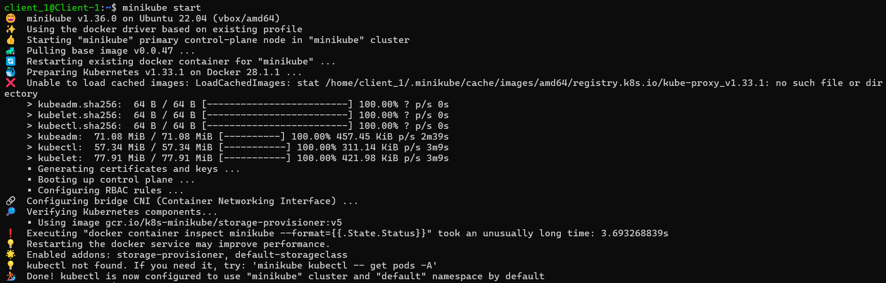
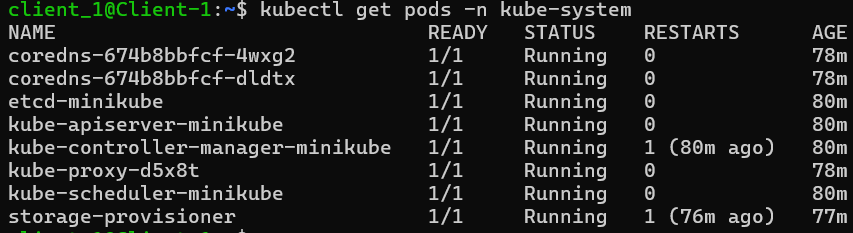
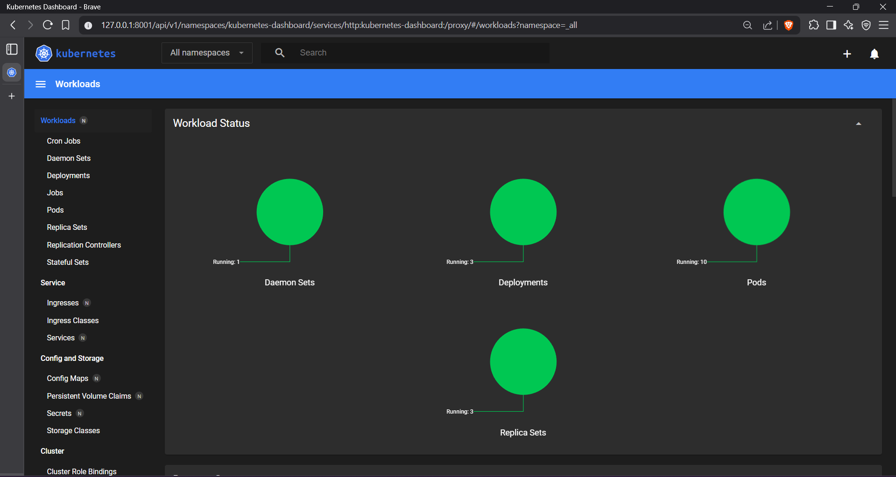

## Introduction

Ever wondered how to set up a local Kubernates cluster for development, testing or learning purposes? Minikube offers the easiest solution for that. With this tutorial I'm going to guide you through the process of deploying a single node Kubernates cluster using Minikube.

## What you'll need

-   Internet connection
-   2 CPUs or more
-   2GB of free memory
-   20GB of free disk space

## What is Minikube?

[Minikube](https://minikube.sigs.k8s.io/docs/) is a tool that makes the provisioning of single node Kubernates clusters easier. It is important to note that this is mostly used for development, testing or learning purposes not in production environments.

## Step 1: Docker Installation

Minikube needs a container runtime to run the Kubernates cluster. If you have already installed one, you can skip this step.

-   Add Docker's GPG key
    ``` bash
    sudo apt-get update
    sudo apt-get install -y ca-certificates curl

    sudo install -m 0755 -d /etc/apt/keyrings
    sudo curl -fsSL https://download.docker.com/linux/ubuntu/gpg -o /etc/apt/keyrings/docker.asc
    sudo chmod a+r /etc/apt/keyrings/docker.asc
    ```

-   Add official repository

    ``` bash
    echo \
    "deb [arch=$(dpkg --print-architecture) signed-by=/etc/apt/keyrings/docker.asc] https://download.docker.com/linux/ubuntu \
    $(. /etc/os-release && echo \"${UBUNTU_CODENAME:-$VERSION_CODENAME}\") stable" | \
    sudo tee /etc/apt/sources.list.d/docker.list > /dev/null

    sudo apt-get update
    ```

-   Install Docker packages

    ``` bash
    sudo apt-get install -y docker-ce docker-ce-cli containerd.io docker-buildx-plugin docker-compose-plugin
    ```

-   Add current user to the `docker` group so that you don't need `sudo` for Docker commands.

    ``` bash
    sudo usermod -aG docker $USER
    ```

## Step 2: Minikube Installation

-   Download Minikube binary from the official repository and install.

    ``` bash
    curl -LO https://github.com/kubernetes/minikube/releases/latest/download/minikube-linux-amd64
    sudo install minikube-linux-amd64 /usr/local/bin/minikube
    rm minikube-linux-amd64
    ```

-   Start Minikube

    ``` bash
    minikube start
    ```

    

## Step 3: Install kubectl

Install kubectl tool. 

> Note: This guide is for Linux. To see the installation process for other operating systems read this [documentation](https://kubernetes.io/docs/tasks/tools/install-kubectl-linux/).

-   Download the latest release binary

    ``` bash
    curl -LO "https://dl.k8s.io/release/$(curl -L -s https://dl.k8s.io/release/stable.txt)/bin/linux/amd64/kubectl"
    ```
-   Install kubectl

    ```bash
    sudo install -o root -g root -m 0755 kubectl /usr/local/bin/kubectl
    ```

## Step 4: Verify Cluster Creation

-   View `kube-system` pods
    ```bash
    kubectl get pods -n kube-system
    ```
    You'll see an output similar to this.

    

-   Access Minikube Dashboard
    ```
    minikube dashboard
    ```
    You'll see the kubernates dashboard opened in a browser window like below.

    

-   You can now use `kubectl` to create any deployment, service, or any other Kubernetes resource inside the cluster. For example, to create a simple deployment, you can run:
    ```bash
    kubectl create deployment hello-minikube --image=nginx
    ```

## Useful Minikube Commands
-   Stop the Minikube cluster:
    ```bash
    minikube stop
    ```
-   Delete the Minikube cluster:
    ```bash
    minikube delete
    ```
-   Restart the Minikube cluster:
    ```bash
    minikube start
    ``` 
-   Check the status of the Minikube cluster:
    ```bash
    minikube status
    ```

## Conclusion

Congratulations! You have successfully set up a single-node Kubernetes cluster using Minikube. You can now deploy applications, test configurations, and learn more about Kubernetes in a local environment.
